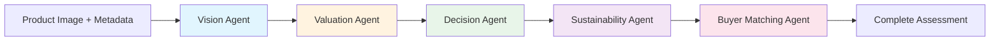

# Technical Design Document

## Overview

This document outlines the technical design for EcoLoop AI, an AI-powered sustainability platform for Amazon HackOn 2026. The design covers the system architecture, component interactions, data models, and API contracts needed to implement the requirements specified in the requirements document.

## Architecture

EcoLoop AI follows a three-tier architecture:

1. **Frontend (React + Tailwind CSS)**: Single-page application handling user interactions, image upload, form input, and dashboard visualization
2. **Backend (FastAPI)**: REST API layer that orchestrates image storage, AI inference, business logic, and data persistence
3. **AWS Services**: Amazon S3 for image storage, Amazon Bedrock for AI inference, and DynamoDB for data persistence

```
┌─────────────────────────────────────────────────────────────────┐
│                      React Frontend (Tailwind)                    │
│  ┌──────────┐  ┌──────────┐  ┌──────────┐  ┌────────────┐      │
│  │  Upload   │  │  Form    │  │ Results  │  │ Dashboard  │      │
│  │  Page     │  │  Input   │  │  View    │  │   View     │      │
│  └──────────┘  └──────────┘  └──────────┘  └────────────┘      │
└───────────────────────────┬─────────────────────────────────────┘
                            │ HTTPS REST API
┌───────────────────────────▼─────────────────────────────────────┐
│                      FastAPI Backend                              │
│                                                                   │
│  ┌──────────────┐    ┌──────────────────────────────────────┐    │
│  │ Upload Service│    │ Assessment Orchestrator               │    │
│  │  (POST /api/ │    │                                      │    │
│  │   upload)    │    │  ┌─────────┐  ┌───────────┐         │    │
│  └──────┬───────┘    │  │ Vision  │→ │ Valuation │         │    │
│         │            │  │ Agent   │  │  Agent    │         │    │
│         │            │  └─────────┘  └─────┬─────┘         │    │
│         │            │                     │               │    │
│         │            │  ┌─────────┐  ┌─────▼─────┐         │    │
│         │            │  │ Sustain-│← │ Decision  │         │    │
│         │            │  │ ability │  │  Agent    │         │    │
│         │            │  │ Agent   │  └───────────┘         │    │
│         │            │  └────┬────┘                        │    │
│         │            │       │     ┌──────────────┐        │    │
│         │            │       └────→│Buyer Matching│        │    │
│         │            │             │   Agent      │        │    │
│         │            │             └──────────────┘        │    │
│         │            └──────────────────┬───────────────────┘    │
│         │                               │                        │
│  ┌──────▼───────┐    ┌─────────────────▼─────┐  ┌───────────┐  │
│  │  Dashboard    │    │                       │  │           │  │
│  │  Service      │    │                       │  │           │  │
│  └──────┬────────┘    │                       │  │           │  │
└─────────┼─────────────┼───────────────────────┼──┼───────────┼──┘
          │             │                       │  │           │
     ┌────▼────┐   ┌────▼─────┐          ┌─────▼──┐    ┌─────▼────┐
     │ DynamoDB│   │  Bedrock │          │ Bedrock│    │    S3    │
     │  Tables │   │  (Vision)│          │ (Text) │    │  Bucket  │
     └─────────┘   └──────────┘          └────────┘    └──────────┘
```

**Data Flow:**
- **Upload**: Frontend → Backend (Upload Service) → S3
- **Assessment**: Frontend → Backend (Assessment Orchestrator → [Vision Agent → Valuation Agent → Decision Agent → Sustainability Agent → Buyer Matching Agent]) → DynamoDB

## Components and Interfaces

### 1. Frontend Components

#### 1.1 Upload Page Component
- **Responsibility**: Handle image file selection, validation, upload progress, and preview
- **Implementation**: React component with drag-and-drop support, file type validation (JPEG/PNG/WebP), size validation (max 10MB), and progress bar using XMLHttpRequest or fetch with progress events
- **State Management**: Local component state for upload progress, preview URL, and error messages

#### 1.2 Product Form Component
- **Responsibility**: Capture product metadata (category, age, original price)
- **Implementation**: React form with controlled inputs, category dropdown with predefined options, numeric validation for age (0-240 months) and price (> 0)
- **Validation**: Client-side validation with inline error messages, server-side validation as secondary check

#### 1.3 Results View Component
- **Responsibility**: Display assessment results including condition grade, explanation, action recommendation, reasoning, resale value, green credits, and buyer personas
- **Implementation**: Card-based layout showing each result section with visual indicators (color-coded grades, icons for actions)
- **Sub-components**: ConditionGradeCard, ActionRecommendationCard, ResaleValueCard, GreenCreditsCard, BuyerPersonaList, ExplanationPanel

#### 1.4 Sustainability Dashboard Component
- **Responsibility**: Display aggregated metrics, charts, and green credits
- **Implementation**: Dashboard layout with summary cards (total credits, total assessments, CO2 saved) and a pie/bar chart for action distribution
- **Charting**: Use a lightweight chart library (e.g., Recharts) for visualization

## Agentic Assessment Pipeline

The core intelligence of EcoLoop AI is delivered through a multi-agent pipeline. Each agent is a focused Python service module that consumes the output of the previous agent, producing a sequential chain of assessment intelligence.

### Agent Pipeline Flow



### Agent Descriptions

#### 1. Vision Agent
- **Input**: Product image (S3 key), product metadata
- **Responsibility**: Analyzes the uploaded product image to detect wear, scratches, damage, missing parts, and visible condition indicators
- **Implementation**: Calls Amazon Bedrock multimodal model (Claude with vision capabilities) with a structured prompt
- **Output**:
  - `condition_grade`: A (Like New), B (Good), C (Fair), or D (Poor)
  - `confidence_score`: 0–100
  - `explanation`: Human-readable explanation (max 150 words) referencing specific visual attributes observed in the image

#### 2. Valuation Agent
- **Input**: Condition signals from Vision Agent (`condition_grade`) + product metadata (`category`, `age_months`, `original_price`)
- **Responsibility**: Estimates resale value range using category-specific depreciation rates and condition multipliers
- **Implementation**: Deterministic business logic (no AI model call)
- **Depreciation Rates** (per month by category):
  - Electronics: 2.5%, Clothing: 3.0%, Furniture: 1.0%, Books: 0.5%, Toys: 2.0%, Appliances: 1.5%, Sports Equipment: 1.8%
- **Condition Multipliers**: A=1.0, B=0.8, C=0.55, D=0.3
- **Formula**: `resale_value = original_price × (1 - monthly_rate × age_months) × condition_multiplier`
- **Output**:
  - `resale_value_min`: resale_value × 0.85
  - `resale_value_max`: resale_value × 1.15

#### 3. Decision Agent
- **Input**: Condition grade from Vision Agent + resale value from Valuation Agent + product metadata
- **Responsibility**: Determines the optimal next action (resell, refurbish, donate, recycle) using rule-based logic and generates a reasoning explanation
- **Implementation**: Deterministic rule engine for action selection; Amazon Bedrock text model for generating reasoning explanation
- **Rules**:
  - "resell": Grade A or B AND resale_value > 20% of original price
  - "refurbish": Grade B or C AND estimated refurbishment cost < 40% of post-refurbishment resale value
  - "donate": Grade C or D AND product is functional but has low resale value
  - "recycle": Grade D AND non-functional OR resale_value < 5% of original price
- **Output**:
  - `action_recommendation`: one of resell, refurbish, donate, recycle
  - `reasoning`: Explanation (max 100 words) referencing condition grade, resale value, and product category

#### 4. Sustainability Agent
- **Input**: Action recommendation from Decision Agent
- **Responsibility**: Calculates green credits and CO2 savings based on the recommended action
- **Implementation**: Deterministic business logic (no AI model call)
- **Green Credits**: resell=10, refurbish=15, donate=20, recycle=5
- **CO2 Savings**: resell=2.5kg, refurbish=1.8kg, donate=1.5kg, recycle=0.8kg
- **Output**:
  - `green_credits`: Number of credits awarded
  - `co2_savings_kg`: Estimated CO2 savings in kilograms

#### 5. Buyer Matching Agent
- **Input**: Product category, condition grade, resale value, action recommendation
- **Responsibility**: Generates up to 3 buyer personas identifying the most suitable next owner. Only triggered when action is "resell"
- **Implementation**: Calls Amazon Bedrock text model with product context to generate persona suggestions
- **Condition**: Only executes when `action_recommendation == "resell"`; skipped otherwise
- **Output**:
  - `buyer_personas`: List of up to 3 personas, each with `label`, `description`, and `relevance_score` (1–10)

### Pipeline Orchestration

The Assessment Orchestrator coordinates the sequential execution of all agents:

```python
async def run_assessment_pipeline(image_key: str, metadata: ProductMetadata) -> Assessment:
    # Step 1: Vision Agent analyzes image
    vision_result = await vision_agent.analyze(image_key, metadata)
    
    # Step 2: Valuation Agent estimates value
    valuation_result = valuation_agent.calculate(vision_result.condition_grade, metadata)
    
    # Step 3: Decision Agent determines action
    decision_result = await decision_agent.decide(
        vision_result.condition_grade, valuation_result, metadata
    )
    
    # Step 4: Sustainability Agent calculates impact
    sustainability_result = sustainability_agent.calculate(decision_result.action_recommendation)
    
    # Step 5: Buyer Matching Agent (conditional)
    buyer_result = None
    if decision_result.action_recommendation == "resell":
        buyer_result = await buyer_matching_agent.match(
            metadata.category, vision_result.condition_grade, valuation_result
        )
    
    return Assessment(
        vision=vision_result,
        valuation=valuation_result,
        decision=decision_result,
        sustainability=sustainability_result,
        buyers=buyer_result
    )
```

### 2. Backend Services

#### 2.1 Upload Service
- **Responsibility**: Accept image uploads from frontend, validate file metadata, store images in S3, return image key and preview URL
- **Endpoint**: `POST /api/upload`
- **MVP Flow**: Frontend sends image file directly to backend → backend validates and uploads to S3 → returns image_key and preview URL
- **Validation**: File type (JPEG/PNG/WebP), file size (max 10MB)

> **Future Production Architecture**: For production scale, replace direct upload with a pre-signed URL pattern: Frontend requests pre-signed URL from backend → uploads directly to S3 → confirms upload to backend. This reduces backend load for large files.

#### 2.2 Assessment Orchestrator
- **Responsibility**: Orchestrate the agentic assessment pipeline — coordinates Vision, Valuation, Decision, Sustainability, and Buyer Matching agents in sequence
- **Endpoints**: `POST /api/assess`
- **Flow**: Receives image key + metadata → runs the 5-agent pipeline → stores complete assessment results in DynamoDB → returns full assessment response

#### 2.3 Value Engine (implemented as Valuation Agent)
- **Responsibility**: Calculate resale value using depreciation formulas
- **Note**: This logic is encapsulated within the Valuation Agent in the agentic pipeline
- **Implementation**: Category-specific depreciation rates applied to original price, adjusted by condition grade
- **Depreciation Model**:
  - Base depreciation per month by category:
    - Electronics: 2.5% per month
    - Clothing: 3.0% per month
    - Furniture: 1.0% per month
    - Books: 0.5% per month
    - Toys: 2.0% per month
    - Appliances: 1.5% per month
    - Sports Equipment: 1.8% per month
  - Condition multipliers: A=1.0, B=0.8, C=0.55, D=0.3
  - Formula: `resale_value = original_price × (1 - monthly_rate × age_months) × condition_multiplier`
  - Value range: min = resale_value × 0.85, max = resale_value × 1.15

#### 2.4 Green Credits Service (implemented as Sustainability Agent)
- **Responsibility**: Calculate and store green credits, compute CO2 savings
- **Note**: This logic is encapsulated within the Sustainability Agent in the agentic pipeline
- **Credit Values**: resell=10, refurbish=15, donate=20, recycle=5
- **CO2 Values**: resell=2.5kg, refurbish=1.8kg, donate=1.5kg, recycle=0.8kg

#### 2.5 Dashboard Service
- **Responsibility**: Aggregate and return sustainability metrics
- **Endpoints**: `GET /api/dashboard`
- **Aggregation**: Query DynamoDB for all user assessments, compute totals in-memory for MVP

### 3. AI Engine (Amazon Bedrock Integration)

The AI Engine capabilities are distributed across the agentic pipeline agents. Bedrock is invoked by the Vision Agent and Buyer Matching Agent; the Decision Agent uses Bedrock for reasoning text generation.

#### 3.1 Condition Grading (Vision Agent)
- **Model**: Amazon Bedrock multimodal model (Claude with vision capabilities)
- **Input**: Product image (base64 or S3 reference) + product metadata
- **Prompt Structure**: Structured prompt requesting grade (A/B/C/D), confidence score (0-100), and explanation (max 150 words referencing visual attributes)
- **Invoked by**: Vision Agent
- **Output Schema**:
```json
{
  "condition_grade": "A|B|C|D",
  "confidence_score": 0-100,
  "explanation": "string (max 150 words)"
}
```

#### 3.2 Action Recommendation Reasoning (Decision Agent)
- **Logic**: Rule-based logic for action selection (deterministic); Bedrock text model for generating the reasoning explanation
- **Rules Engine**: Primary decision based on grade and value thresholds (deterministic, no AI call)
- **AI Enhancement**: Bedrock generates the reasoning explanation (max 100 words) referencing condition grade, resale value, and product category
- **Invoked by**: Decision Agent
- **Output Schema**:
```json
{
  "recommendation": "resell|refurbish|donate|recycle",
  "reasoning": "string (max 100 words)"
}
```

#### 3.3 Buyer Persona Generation (Buyer Matching Agent)
- **Model**: Amazon Bedrock text model
- **Input**: Product category, condition grade, resale value
- **Invoked by**: Buyer Matching Agent (only when action is "resell")
- **Output Schema**:
```json
{
  "personas": [
    {
      "label": "string",
      "description": "string",
      "relevance_score": 1-10
    }
  ]
}
```

## Data Models

### DynamoDB Table: Assessments

| Attribute | Type | Description |
|-----------|------|-------------|
| assessment_id (PK) | String | UUID for the assessment |
| user_session_id (SK) | String | Session identifier for the user |
| created_at | String (ISO 8601) | Timestamp of assessment creation |
| image_key | String | S3 object key for the product image |
| product_category | String | Product category from predefined list |
| product_age_months | Number | Product age in months |
| original_price | Number | Original price in USD |
| condition_grade | String | A, B, C, or D |
| confidence_score | Number | 0-100 confidence for grade |
| grade_explanation | String | AI explanation for the grade |
| action_recommendation | String | resell, refurbish, donate, or recycle |
| action_reasoning | String | AI reasoning for the recommendation |
| resale_value_min | Number | Minimum estimated resale value |
| resale_value_max | Number | Maximum estimated resale value |
| green_credits | Number | Credits awarded |
| co2_savings_kg | Number | Estimated CO2 savings |
| buyer_personas | List | List of buyer persona objects (if resell) |

### DynamoDB Table: UserMetrics

| Attribute | Type | Description |
|-----------|------|-------------|
| user_session_id (PK) | String | Session identifier |
| total_green_credits | Number | Accumulated green credits |
| total_assessments | Number | Count of assessments |
| total_co2_saved_kg | Number | Total CO2 savings |
| action_counts | Map | Count per action type |
| last_updated | String (ISO 8601) | Last update timestamp |

## API Contracts

### POST /api/upload

**Request:** `multipart/form-data`
- `file`: Image file (JPEG, PNG, or WebP, max 10MB)

**Response (200):**
```json
{
  "image_key": "uploads/uuid/product.jpg",
  "preview_url": "https://s3.amazonaws.com/...(presigned)"
}
```

**Error (400):**
```json
{
  "error": "file_too_large",
  "message": "File size exceeds 10 MB limit"
}
```

**Error (400):**
```json
{
  "error": "invalid_format",
  "message": "File must be JPEG, PNG, or WebP format"
}
```

> **Future Production Architecture**: Replace with pre-signed URL flow:
> - `POST /api/upload/presigned-url` — Returns a pre-signed S3 URL for direct upload
> - `POST /api/upload/confirm` — Confirms the upload was completed

### POST /api/assess

**Request:**
```json
{
  "image_key": "uploads/uuid/product.jpg",
  "product_category": "Electronics",
  "product_age_months": 18,
  "original_price": 599.99
}
```

**Response (200):**
```json
{
  "assessment_id": "uuid",
  "condition_grade": "B",
  "confidence_score": 82,
  "grade_explanation": "The product shows minor cosmetic wear on the edges and a small scratch on the screen. The overall structure appears intact with all buttons and ports visible and undamaged.",
  "action_recommendation": "resell",
  "action_reasoning": "With a Good condition grade and resale value at 35% of original price, reselling maximizes value recovery and reduces waste.",
  "resale_value": {
    "min": 142.50,
    "max": 192.30,
    "display": "$142 - $192"
  },
  "green_credits": 10,
  "co2_savings_kg": 2.5,
  "buyer_personas": [
    {
      "label": "Budget Tech Enthusiast",
      "description": "A tech-savvy buyer looking for functional electronics at a discount",
      "relevance_score": 8
    },
    {
      "label": "Student",
      "description": "A college student seeking affordable electronics for coursework",
      "relevance_score": 7
    }
  ]
}
```

### GET /api/dashboard

**Response (200):**
```json
{
  "total_green_credits": 85,
  "total_assessments": 6,
  "total_co2_saved_kg": 11.4,
  "action_distribution": {
    "resell": 3,
    "refurbish": 1,
    "donate": 1,
    "recycle": 1
  },
  "recent_assessments": [
    {
      "assessment_id": "uuid",
      "product_category": "Electronics",
      "condition_grade": "B",
      "action_recommendation": "resell",
      "created_at": "2025-01-15T10:30:00Z"
    }
  ]
}
```

## Correctness Properties

*A property is a characteristic or behavior that should hold true across all valid executions of a system — essentially, a formal statement about what the system should do. Properties serve as the bridge between human-readable specifications and machine-verifiable correctness guarantees.*

### Property 1: File Format Validation

*For any* file metadata submitted for upload, the platform SHALL accept the file if and only if its content type is one of JPEG, PNG, or WebP, and SHALL reject the file with an appropriate error otherwise.

**Validates: Requirements 1.1, 1.4**

### Property 2: Product Metadata Validation

*For any* product metadata submission, the platform SHALL reject the submission if any required field is empty, if product age is outside the range 0–240 months, or if original price is less than or equal to 0.

**Validates: Requirements 2.2, 2.3, 2.4**

### Property 3: Resale Value Depreciation Formula

*For any* valid product with a known category, age in months, original price, and condition grade, the Value Engine SHALL calculate the resale value as `original_price × (1 - category_monthly_rate × age_months) × condition_multiplier`, applying the category-specific depreciation rate defined in the design.

**Validates: Requirements 5.1, 5.2, 5.4**

### Property 4: Resale Value Range Invariant

*For any* calculated resale value V, the displayed range SHALL have minimum = V × 0.85 and maximum = V × 1.15, ensuring min < max for all positive values.

**Validates: Requirements 5.3**

### Property 5: Action Recommendation Rules

*For any* product with a valid condition grade and computed resale value, the recommendation engine SHALL produce exactly one of "resell", "refurbish", "donate", or "recycle" according to the defined business rules: "resell" for grade A/B with resale value > 20% of original price; "recycle" for grade D with resale value < 5% of original price; and appropriate intermediate recommendations otherwise.

**Validates: Requirements 4.1, 4.2, 4.3, 4.4, 4.5**

### Property 6: Green Credits Formula

*For any* completed assessment with a valid action recommendation, the platform SHALL award exactly 10 credits for "resell", 15 for "refurbish", 20 for "donate", and 5 for "recycle".

**Validates: Requirements 6.1, 6.2**

### Property 7: CO2 Savings Calculation

*For any* sequence of completed assessments, the total CO2 savings SHALL equal the sum of per-action values: 2.5 kg per "resell", 1.8 kg per "refurbish", 1.5 kg per "donate", and 0.8 kg per "recycle".

**Validates: Requirements 7.3, 7.4**

### Property 8: Buyer Persona Conditional Generation

*For any* completed assessment, buyer personas SHALL be generated (with 1–3 personas, each having a non-empty label, non-empty description, and relevance score between 1 and 10) if and only if the action recommendation is "resell". For any other recommendation, no personas SHALL be generated.

**Validates: Requirements 8.3, 8.4**

### Property 9: Explanation Length Constraints

*For any* AI-generated condition grade explanation, the word count SHALL not exceed 150 words. *For any* AI-generated action recommendation reasoning, the word count SHALL not exceed 100 words.

**Validates: Requirements 9.1, 9.2**

### Property 10: Pre-signed URL Expiry

*For any* pre-signed URL generated for image storage access, the expiry duration SHALL be at most 15 minutes (900 seconds).

**Validates: Requirements 12.2**

## Error Handling

1. **Frontend Validation**: Immediate feedback for file type, size, and form field errors
2. **Backend Validation**: Re-validate all inputs; return 400 with structured error responses
3. **AI Failures**: Retry up to 3 times with exponential backoff (1s, 2s, 4s delays)
4. **S3 Failures**: Queue upload confirmation and retry; show user-friendly retry option
5. **DynamoDB Failures**: Log error, retry write; assessment results displayed even if persistence temporarily fails

## Security Considerations

1. **Transport**: All API calls over HTTPS
2. **S3 Access**: Pre-signed URLs with 15-minute expiry; no public bucket access
3. **Input Sanitization**: All user input validated and sanitized server-side before Bedrock prompts or DB writes
4. **CORS**: Frontend origin whitelisted in FastAPI CORS middleware
5. **File Validation**: Server-side content-type verification of uploaded images beyond extension checking

## Technology Decisions

| Decision | Choice | Rationale |
|----------|--------|-----------|
| Frontend Framework | React + Tailwind CSS | Rapid UI development, component reusability |
| Backend Framework | FastAPI | Async support, auto-generated docs, Python Bedrock SDK |
| Image Storage | Amazon S3 | Scalable object storage, pre-signed URL support |
| AI Inference | Amazon Bedrock | Managed multimodal AI, no model hosting required |
| Database | Amazon DynamoDB | Serverless, low-latency key-value access |
| Upload Pattern | Direct upload via backend (MVP) | Simple implementation for hackathon; pre-signed URL pattern for future production |
| Session Model | Browser session ID (no auth) | Sufficient for hackathon MVP single-user demo |

## Deployment Architecture (MVP)

- **Frontend**: Static build served via S3 + CloudFront (or local dev server for demo)
- **Backend**: Single FastAPI instance (local or EC2 for demo)
- **AWS Region**: Same region for S3, Bedrock, and DynamoDB to minimize latency

## Testing Strategy

### Unit Tests

Unit tests verify specific examples, edge cases, and error conditions:

- **File validation**: Test specific valid/invalid file types and sizes
- **Form validation**: Test specific form submissions with missing fields, boundary values
- **Value Engine edge cases**: Test resale value < $1 display, zero-age products, maximum-age products
- **Action recommendation edge cases**: Test boundary conditions between recommendation categories
- **Green credits edge cases**: Verify correct credit assignment for each action type
- **AI response parsing**: Test handling of malformed AI responses
- **Error handling**: Test retry logic with mocked transient failures, S3 unavailability

### Property-Based Tests

Property-based tests verify universal properties across all valid inputs. Each property test runs a minimum of 100 iterations.

- **Library**: Hypothesis (Python) for backend property tests
- **Configuration**: Minimum 100 examples per property, with explicit settings for reproducibility
- **Tagging**: Each test tagged with `Feature: ecoloop-ai, Property {number}: {property_text}`

Properties to implement:
1. File format validation (Property 1)
2. Product metadata validation (Property 2)
3. Resale value depreciation formula correctness (Property 3)
4. Resale value range invariant (Property 4)
5. Action recommendation rules (Property 5)
6. Green credits formula (Property 6)
7. CO2 savings calculation (Property 7)
8. Buyer persona conditional generation (Property 8)
9. Explanation length constraints (Property 9)
10. Pre-signed URL expiry (Property 10)

### Integration Tests

Integration tests verify external service interactions with 1–3 representative examples:

- **S3 upload**: Verify image storage and retrieval with pre-signed URLs
- **Bedrock inference**: Verify condition grading returns valid grade and confidence score
- **DynamoDB persistence**: Verify assessment data is stored and retrievable
- **End-to-end assessment flow**: Submit image + metadata, verify full assessment pipeline completes

### Smoke Tests

Smoke tests verify configuration and environment setup:

- **HTTPS enforcement**: Verify all endpoints use HTTPS
- **CORS configuration**: Verify frontend origin is whitelisted
- **AWS connectivity**: Verify S3, Bedrock, and DynamoDB are reachable
- **Page load performance**: Verify pages render within 2 seconds
